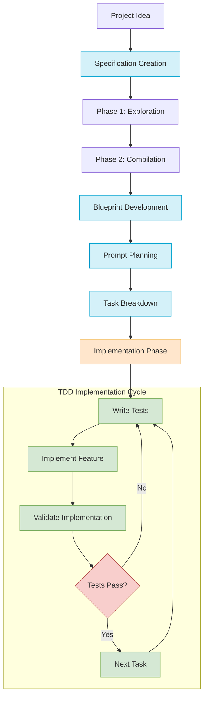

# Prompt-Based Development Process Guide

This guide documents the systematic process for taking a project from initial idea to implementation using a prompt-based development workflow. The process uses a series of carefully crafted prompts with AI assistance to produce each artifact in the development lifecycle.

## Overview of the Process

The prompt-based development process follows these key stages:

1. **Specification Creation** - Converting a project idea into a comprehensive, developer-ready specification
2. **Blueprint Development** - Breaking down the specification into a technical implementation plan
3. **Prompt Planning** - Creating a structured set of prompts for implementation
4. **Task Breakdown** - Converting the plan into actionable, trackable tasks
5. **Implementation** - Executing the tasks following TDD principles

This document provides the prompts used for each stage and guidance on how to apply them effectively.

## Process Workflow Diagram

The following diagram illustrates the complete prompt-based development workflow with its TDD focus:



This diagram shows the progression from a project idea through specification creation, blueprint development, prompt planning, task breakdown, and finally to the implementation phase which follows strict TDD principles.

## 1. Specification Creation

The first step is to create a detailed specification document that serves as the foundation for development. The specification should be comprehensive enough for developers to understand exactly what needs to be built.

### The Specification Prompt: Phase 1 - Exploration

```
Let's develop a detailed, developer-ready specification for this project through an iterative conversation. I'll ask one focused question at a time, building on your previous answers to explore all technical aspects thoroughly.

For each response, please prioritize using existing libraries, frameworks, and services rather than custom implementations. My goal is to create a specification document that includes:
1. Clear technical requirements and constraints
2. Architecture and data flow diagrams
3. Data models with field definitions
4. Authentication and security implementations using established libraries
5. Error handling and edge cases
6. API interactions with recommended client libraries
7. Monitoring and observability using existing tools
8. Code examples for critical functionality that demonstrate library usage

When describing technical approaches:
- Identify specific libraries and packages that solve common problems (authentication, API clients, encryption, etc.)
- Suggest 2-3 alternatives with pros and cons so I can make informed decisions
- Highlight community adoption, maintenance status, and documentation quality for suggested libraries
- Consider compatibility with our core technologies

Remember, our final document should emphasize developer efficiency by leveraging battle-tested solutions while maintaining flexibility for custom business logic.

Here's the core idea we'll be exploring: [YOUR PROJECT IDEA]
```

### The Specification Prompt: Phase 2 - Compilation

Once you've explored all aspects of the project through the iterative Q&A process above and have gathered sufficient information, use this prompt to compile everything into a coherent specification document:

```
Can you compile our findings into a comprehensive, developer-ready specification? Include all relevant requirements, architecture choices, data handling details, error handling strategies, and a testing plan so a developer can immediately begin implementation.

Please organize the document with clear sections for:
1. Project Overview and Objectives
2. Functional Requirements
3. Technical Architecture with diagrams
4. Data Models and Storage
5. External API Integrations (with specific libraries to use)
6. Security Implementation
7. Error Handling Strategy
8. Performance Considerations
9. Testing and Quality Assurance Plan
10. Implementation Roadmap

For each technical component, indicate the recommended libraries and frameworks we discussed, with brief justifications for these choices. Ensure every feature discussed in our conversation is properly documented with sufficient implementation detail.
```

### How to Use These Prompts

Phase 1: Exploration
1. Start with the exploration prompt to gather detailed information through Q&A
2. Answer each question thoroughly, providing as much detail as possible
3. Continue until all aspects of the project have been explored

Phase 2: Compilation
1. Once you've covered all necessary details, use the compilation prompt
2. This will transform the Q&A information into a structured, cohesive document
3. Review the compiled specification for any gaps or inconsistencies
4. Request revisions as needed to ensure completeness

This two-phase approach ensures both thorough exploration of requirements and a well-structured final specification document.

### Example Specification Output

The output will be a comprehensive specification document like the one in `sample/spec.md`, which includes:

- Project overview
- Key features with detailed descriptions
- Architecture diagrams and components
- Data models and database schema
- Authentication flows
- Error handling strategies
- Security considerations
- Code examples for critical functionality
- Monitoring and observability plans
- Testing plan

### Tips for Effective Specification Development

- Answer questions with implementation details rather than general concepts
- Consider edge cases and error scenarios early in the process
- When multiple technical approaches are suggested, evaluate them carefully before deciding
- Ask follow-up questions if you need clarification on technical suggestions
- Request specific library recommendations for key functionality

The specification serves as the foundation for all subsequent development work, so investing time in making it comprehensive will save development time later.

## 2. Blueprint Development

After creating a comprehensive specification, the next step is to break it down into a technical blueprint that outlines the implementation approach. The blueprint serves as a bridge between the high-level specification and the actual implementation.

### The Blueprint Prompt

```
I want you to create a detailed technical blueprint for implementing the specification I'll share with you. The blueprint should break down the project into clear components and modules that can be implemented independently.

For each component, include:
1. A description of its purpose and functionality
2. Its relationships and dependencies with other components
3. Technical implementation details with specific libraries and frameworks
4. Data structures and interfaces it will use or expose
5. Required test coverage and validation approaches
6. A complexity estimate (Low/Medium/High)
7. Potential technical challenges and how to address them

Structure the blueprint to allow for test-driven, incremental development where each component can be built and tested independently. Prioritize components based on dependencies and core functionality.

Please identify places where we can leverage existing libraries and frameworks rather than building from scratch. For any critical technical decisions, provide 2-3 alternatives with pros and cons.

Here's the specification to use as the basis for this blueprint:

[PASTE YOUR SPECIFICATION HERE]
```

### How to Use This Prompt

1. Replace `[PASTE YOUR SPECIFICATION HERE]` with your complete specification document
2. Submit the prompt to generate a technical blueprint
3. Review the blueprint for completeness and technical feasibility
4. Request refinements if needed to address specific technical concerns
5. Finalize the blueprint as a reference for implementation planning

### Example Blueprint Output

The blueprint will provide a structured breakdown of the project into implementable components, including:

- Core modules and their responsibilities
- Component dependencies and relationships
- Technical implementation details for each component
- API interfaces between components
- Database schema and data access patterns
- Authentication and security implementation details
- External dependencies and integration points
- Test coverage requirements for each component

### Tips for Effective Blueprint Development

- Ensure the blueprint covers all features described in the specification
- Validate that the component breakdown allows for incremental development
- Confirm that external dependencies and libraries are appropriate for your project
- Check that security concerns are adequately addressed in the blueprint
- Verify that the blueprint provides sufficient detail for implementation planning
- Ensure test coverage approaches are clearly defined for each component

## 3. Prompt Planning

With a technical blueprint in hand, the next step is to create a prompt plan that outlines the series of prompts needed to implement each component. This plan serves as a guide for the actual implementation phase.

### The Prompt Planning Prompt

```
I'd like to create a structured prompt plan for implementing the technical blueprint I'll share with you. This plan will outline the sequence of prompts needed to guide an AI assistant through the implementation process.

For each component in the blueprint, create a series of focused prompts that:
1. Follow strict Test-Driven Development principles where EVERY implementation prompt is preceded by a test creation prompt
2. Break down complex components into manageable implementation steps
3. Focus on one clear task or feature per prompt
4. Include context from previous steps when necessary
5. Address edge cases and error handling explicitly

For each implementation step, create a pair of prompts:
- First prompt: Writing tests for the functionality
- Second prompt: Implementing the functionality to pass those tests

Structure the prompts to build the system incrementally, ensuring each step produces working and testable code. Include prompts for:
- Setting up the project and testing environment
- Creating test cases for each component BEFORE implementation
- Implementing core functionality for each component
- Creating interfaces between components
- Handling authentication and security
- Adding error handling and validation
- Documentation of code and APIs

Here's the technical blueprint to use as the basis for the prompt plan:

[PASTE YOUR BLUEPRINT HERE]
```

### How to Use This Prompt

1. Replace `[PASTE YOUR BLUEPRINT HERE]` with your complete technical blueprint
2. Submit the prompt to generate a prompt plan
3. Review the prompt plan for coverage of all components in the blueprint
4. Refine the plan as needed to ensure a logical implementation sequence
5. Save the prompt plan as a guide for the implementation phase

### Example Prompt Plan Output

The prompt plan will provide a structured sequence of prompts for implementing each component, including:

- Project setup prompts
- Test creation prompts for each feature
- Implementation prompts for making tests pass
- Integration prompts for connecting components
- Validation prompts for ensuring system correctness
- Documentation prompts for code and API docs

### Tips for Effective Prompt Planning

- Ensure the prompt plan follows a logical sequence based on component dependencies
- Verify that each implementation prompt is preceded by a corresponding test prompt
- Confirm that prompts include sufficient context from previous steps
- Check that the prompt plan covers all components in the blueprint
- Ensure that complex functionality is broken down into manageable steps

## 4. Task Breakdown

The final planning step is to convert the prompt plan into actionable tasks with unique identifiers. This task breakdown serves as the todo list for the implementation phase.

### The Task Breakdown Prompt

```
I need to convert the prompt plan I'll share with you into a structured task list for implementation. Please create a todo.md file with the following:

1. Break down each prompt in the plan into one or more specific tasks
2. Assign each task a unique identifier using the format zeno-X.Y.Z where:
   - X is the major component number
   - Y is the subcomponent number
   - Z is the task number
3. Structure tasks hierarchically by component and subcomponent
4. Mark each task with a checkbox [ ] for tracking completion
5. Include brief descriptions that clearly state what needs to be done
6. Add complexity estimates (Low/Medium/High) for each task
7. Note dependencies between tasks where applicable
8. Ensure that EVERY implementation task is preceded by a corresponding test task

Format the todo list in Markdown with clear headings and nested lists to show the hierarchy. For EACH feature or function, make sure there are separate tasks for:
1. Writing tests
2. Implementing the feature
3. Validating the implementation

Here's the prompt plan to convert into tasks:

[PASTE YOUR PROMPT PLAN HERE]
```

### How to Use This Prompt

1. Replace `[PASTE YOUR PROMPT PLAN HERE]` with your complete prompt plan
2. Submit the prompt to generate a task breakdown
3. Review the task list for completeness and accurate task dependencies
4. Refine the tasks as needed to ensure they're actionable and clear
5. Save the finalized task list as todo.md for reference during implementation

### Example Task Breakdown Output

The task breakdown will provide a structured todo list in Markdown format, including:

- Major components as top-level sections
- Subcomponents as subsections
- Individual tasks with unique identifiers
- Checkboxes for tracking completion status
- Task descriptions and complexity estimates
- Notes on dependencies between tasks

### Tips for Effective Task Breakdown

- Ensure tasks are small enough to be completed in a single implementation session
- Verify that task identifiers follow the PROJECT-X.Y.Z format consistently
- Confirm that dependencies between tasks are clearly noted
- Check that all tasks from the prompt plan are included in the breakdown
- Make task descriptions specific and actionable

## 5. Implementation Phase

With all planning artifacts in place, the implementation phase can begin. This phase follows the task breakdown and uses the prompts from the prompt plan to guide the implementation of each component.

### Implementation Process

1. Start with the first task in the todo.md file
2. Use the corresponding prompt from the prompt plan to guide implementation
3. Follow TDD principles by writing tests before implementation
4. Implement the feature and verify tests pass
5. Mark the task as complete in the todo.md file
6. Commit changes with a message referencing the task ID
7. Move on to the next task, following the dependencies

### Git Workflow Integration

The implementation phase integrates with the Git workflow described in `.tools/git-templates/git_workflow.md`, which includes:

- Creating feature branches for related tasks
- Writing commit messages that reference task IDs
- Using pre-commit hooks to ensure tests pass
- Creating pull requests when task groups are complete
- Tagging milestones when phases are completed

By following this structured approach from specification to implementation, the prompt-based development process ensures a systematic and traceable development workflow that produces high-quality, well-tested code.

## Appendix: Sample Context Prompts

This appendix provides sample context prompts that can be used when working on different phases of the prompt-based development process. These prompts help reorient the AI assistant when you need to provide context about the current state of work.

### Specification Context Prompt

Use this prompt to provide context when working on a specification:

```
Let me provide you some context. We started working together on an idea of mine, that we captured in detail in the spec.md file. 

We then created a blueprint of the implementation, and saved it in the blueprint.md file.

Finally, we created a series of prompts that we can use to build the solution. We captured them in the prompt_plan.md file, and we also created the todo.md file to keep track of our progress.
```

### Blueprint Context Prompt

Use this prompt to provide context when working on a blueprint:

```
Let me provide you with some context about our work. We've completed the specification phase for this project, which is documented in the spec.md file.

We're now working on the blueprint phase, creating a technical implementation plan that breaks down the project into components. We're documenting this in the blueprint.md file.

Our next steps will be to create a prompt plan and task breakdown based on this blueprint.
```

### Prompt Planning Context Prompt

Use this prompt to provide context when working on prompt planning:

```
Here's some context on our progress. We've completed both the specification (spec.md) and the blueprint (blueprint.md) for this project.

We're currently working on creating a prompt plan (prompt_plan.md) that outlines the sequence of prompts needed to implement each component from our blueprint. This plan follows TDD principles where every implementation prompt is preceded by a test creation prompt.

After this phase, we'll convert the prompt plan into actionable tasks in the todo.md file.
```

### Task Implementation Context Prompt

Use this prompt when implementing tasks from the todo list:

```
Let me provide context on where we are in the development process. We have:
1. A completed specification in spec.md
2. A technical blueprint in blueprint.md
3. A prompt plan in prompt_plan.md
4. A task breakdown in todo.md

We're currently implementing task [TASK-ID] which involves [brief description]. We're following the TDD approach where we write tests first, then implement the functionality to make the tests pass.

The previous tasks we've completed are [list of completed task IDs], and the code is now in a state where [describe current state].
```

### Code Review Context Prompt

Use this prompt when reviewing implemented code:

```
We need to review the code we've implemented for task [TASK-ID]. The task was to [brief description], and the implementation is based on our:
1. Specification in spec.md
2. Blueprint in blueprint.md
3. Prompt plan in prompt_plan.md

The implementation should satisfy these requirements:
[List key requirements]

The tests for this functionality are in [test file path], and the implementation is in [implementation file path].
```

These context prompts help establish the current stage of development and provide the AI assistant with the necessary information to continue work effectively. Adapt them as needed for your specific project circumstances.